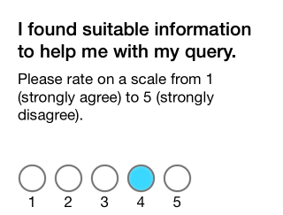
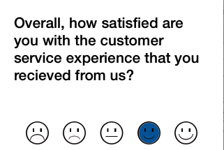
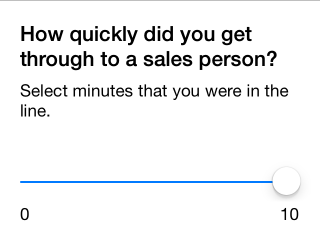
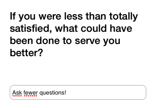
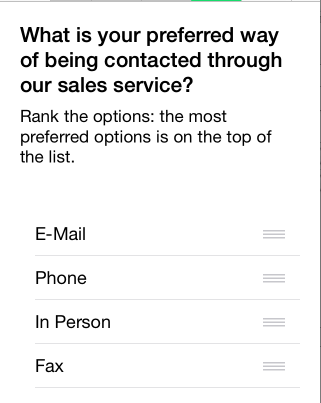

# QULQuestionnaire-iOS

[](http://cocoadocs.org/docsets/QULQuestionnaire/)
[](http://cocoadocs.org/docsets/QULQuestionnaire/)
[](https://www.apache.org/licenses/LICENSE-2.0.html)

QULQuestionnaire provides a drop-in solution for presenting an in-app questionnaire to the user. It may fetch questionnaire data from a remote server and build the questionnaire at runtime with the following options:


##Questionaire items & JSON format


###Single selection (radio)
```json
{
  "key": STRING,
  "type": "radio",
  "orientation": STRING ("horizontal" | "vertical") 
  "question": STRING,        
  "instruction": STRING,
  "required": BOOL,
  "randomized": BOOL,
  "other": BOOL // optional; only available in vertical orientation
  "options": [
    {
      "key": STRING,
      "value": STRING,
      "default": BOOL // optional
    }
  ]
}
```



###Overall rating (smiley scale)
```json
{
  "key": STRING,
  "type": "smiley",
  "question": STRING,
  "instruction": STRING, 
  "required": BOOL
}
```


###Multiple selection (checkbox)
```json
{
  "key": STRING,
  "type": "checkbox",
  "question": STRING,
  "instruction": STRING,    
  "required": BOOL,
  "randomized": BOOL,
   "maxSelectable": INT, // optional
   "options": [
     {
       "key": STRING,
       "value": STRING,
       "selected": BOOL // optional
      }
    ]
}
```

###Value from range (slider)
```json
{
  "key": STRING,
  "type": "slider",
  "question": STRING,
  "instruction": STRING,
  "required": BOOL,
  "minValue": FLOAT,
  "maxValue": FLOAT,
  "minLabel": STRING,
  "maxLabel": STRING,
  "showSelectedValue": BOOL, // optional
  "stepValue": INT // optional
}
```


###Text
```json
{
  "key": STRING,
  "type": "text",
  "question": STRING,
  "input": STRING ("text" | "number" | "email") , // optional, defaults to text
  "instruction": STRING,
  "placeholder": STRING,
  "required": BOOL
}
```


###Ranking
```json
{
  "key": STRING,
  "type": "sortable",
  "question": STRING,    
  "instruction": STRING,
  "required": BOOL,
  "randomized": BOOL,
  "options": [
    {
      "key": STRING,
      "value": STRING
    }
  ]
}
```


#Installation

##Manual

Copy all files from the QULQuestionnare folder to your project.

## CocoaPods

```ruby
platform :ios, '7.0'
pod "QULQuestionnaire", "~> 0.1"
```

#Requirements
* iOS7 (will work on iOS6 without RMStepsController)
* ARC

#Dependencies
* https://github.com/CooperRS/RMStepsController

#License

QULQuestionnaire-iOS is licensed under the terms of the [Apache License, version 2.0](http://www.apache.org/licenses/LICENSE-2.0.html). Please see the [LICENSE](LICENSE) file for full details.
